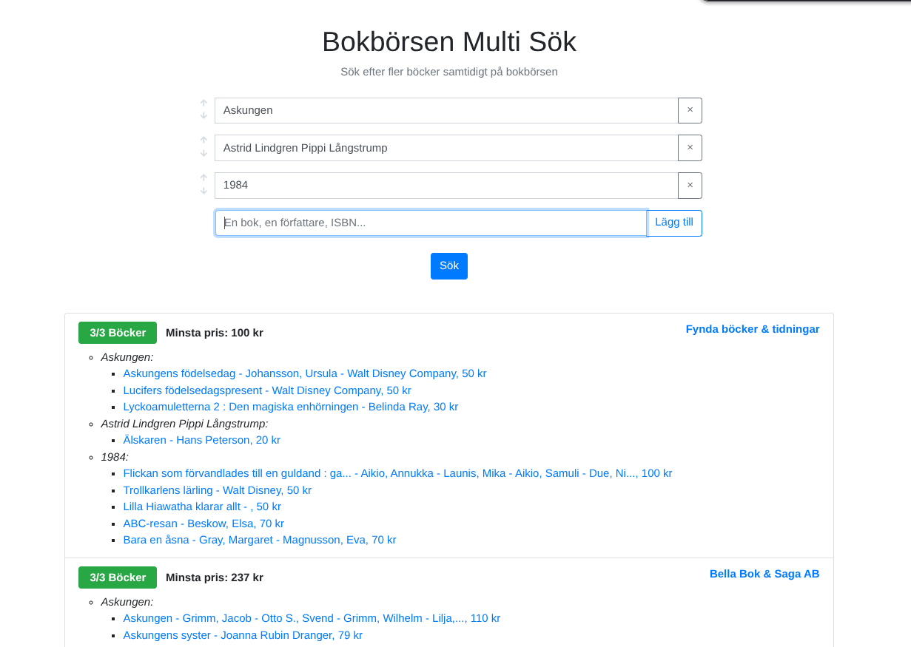

# Daniel Gherghetta
**Welcome to my GitHub**

**Fullstack dreamer** and code tinkerer in Borås, Sweden, currently one year into my systemutvecklare program at **YrkesHögskolan Borås**. I love experimenting with new technologies and working with others building all sorts of projects – from web tools and design clones to little games and handy CLI utilities.

## 🚀 Projects & Highlights

* **Bokbörsen Multi Search** 
– C# Blazor web tool to search for multiple books at once on *Bokbörsen* (a Swedish used-books marketplace) and find single sellers who have many of them. *Why?* On Bokbörsen, shipping is per seller – this tool helps you save on shipping by bundling purchases from one seller. **[Repo](https://github.com/gherghett/Bokborsen-Multi-Search)** · **[Live Demo](https://bokborsenmultisearch.grgta.xyz)**

* **Personal Site Generator** *(Daniels-Hemsida)* – The source code behind [**grgta.xyz**](https://grgta.xyz), my personal website. It’s a custom **static site generator** built from scratch in Python using Markdown files for content. I built this to learn how static site generators work under the hood (instead of using off-the-shelf solutions). **[Repo](https://github.com/gherghett/Daniels-Hemsida)**

* **Visual Clones** – Recreating the look and feel of real websites to sharpen my frontend skills:

  * *SCB.se Clone* – HTML/CSS (Tailwind) visual **clone of the SCB** (Statistics Sweden) website, practicing responsive design and layout. **[Repo](https://github.com/gherghett/SCB-klon)**
  * *Systembolaget Clone* – A study of CSS Grid by replicating **Systembolaget’s** design. **[Repo](https://github.com/gherghett/Systemet)**
  * *“Streamflix”* – A Netflix-inspired streaming UI concept with **AI-generated movie posters**. This was a fun project to explore creative web design (and play with AI image generation). Spent a whole day on prompting the images.

* **Games** – A few hobby game projects, because why not:
   

  * *DOM Snake* 
  – A twist on the classic Snake game written in **vanilla JS**, rendered entirely with HTML/CSS (no canvas). It gets tricky as the snake grows! **[Repo](https://github.com/gherghett/DOM-Snake)** **[Play](https://gherghett.github.io/DOM-Snake/)**

  * *You Are The Weapons Manager* – A **Godot** game jam entry (PirateSoftware Jam #16) that flips the Vampire Survivors genre on its head – instead of being the hero, you manage the hero’s weapons and upgrades. **[Repo](https://github.com/gherghett/YouAreTheWeaponsManager)**
  * *Pinball* – A mini browser **pinball game** built to try the Godot game engine. It has a twist after the first level. Play it on my site! **[Play Here](https://grgta.xyz/stuff/pinball/)**

* **Web Dev**

  * *Calendar Todo App in React* - A simple responsive calendar-based todo list built using React and Tailwind CSS. Without using a full bundler setup - kind of crazy how far you can get with CDNs! **[Repo](https://github.com/gherghett/Calendar-Todo-App-in-React)** **[Demo](https://gherghett.github.io/Calendar-Todo-App-in-React/)**

   

  * *Draggable Cards - React & Vite* - UI demo of draggable, animated cards — inspired by cards in games like Pokémon or Magic: The Gathering. Not best fit for React but the cards were the starting point of the idea. This was a fun UI experiment to explore drag mechanics in JS. **[Repo](https://github.com/gherghett/Draggable-Cards---React-Vite)** **[Demo](https://gherghett.github.io/Draggable-Cards---React-Vite/)**

* **CLI Tools** – Little command-line utilities to automate tasks and make life easier:

  * *InputHandler* – A simple **C# library** for handling console input, making it easier to build interactive command-line apps. **[Repo](https://github.com/gherghett/InputHandler)**
  * *README Maker* – A Python CLI that uses the **OpenAI API** to generate a README.md from a project’s codebase. Great for jumpstarting documentation. **[Repo](https://github.com/gherghett/readme_maker_openAI)**
  * *Lineup Screenshots* – A handy script to automatically **line up screenshots** (or any images) side-by-side into one image. Useful for before/after comparisons or documentation. I actually use this quite a bit. **[Repo](https://github.com/gherghett/lineup-screenshots)**

## 🌱 What I’m Up To

Aside from school projects and the ones above, I’m always tinkering with new ideas and learning new tech. Lately, I've been exploring AI APIs, responsive design techniques, and the Godot game engine.

**➡️ Feel free to check out my personal site [grgta.xyz](https://grgta.xyz)** for more projects, info about me, and links to connect (like my LinkedIn). Thanks for reading! 🎉
